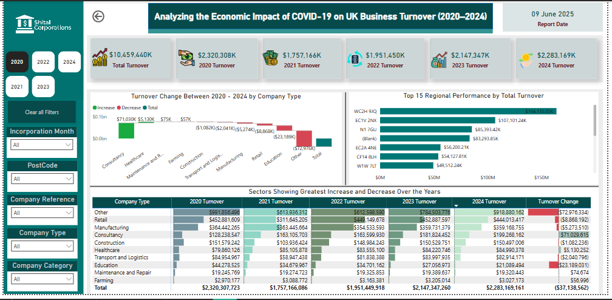
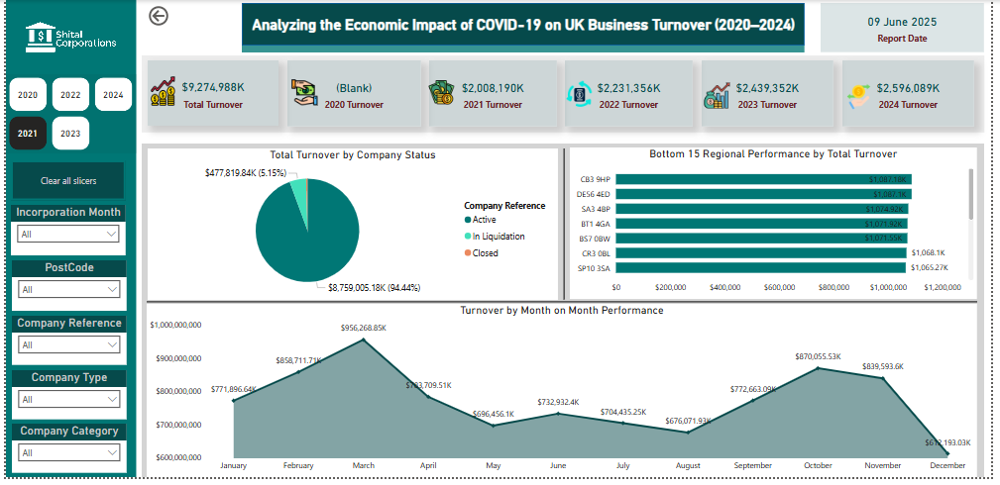

# Turnover Interactive Report

*A comprehensive analysis of UK business turnover data investigating pandemic impacts*

## Overview
This project involves a comprehensive analysis and visualization of UK business turnover data across different company types, statuses, and regions using a tax-related dataset. The analysis focuses on how the COVID-19 pandemic and the subsequent recovery phase affected business turnover across various sectors and geographic locations.

## Tools Used
- **SQL**: Data cleaning, transformation, and analysis
- **Power BI**: Data visualization and dashboard creation
  - Features: Slicers, Pivot Charts, DAX, Bar Charts, Visual Header Tooltips, Measures

## Business Objectives
- Evaluate the economic impact of COVID-19 and post-pandemic recovery on UK business turnover
- Identify which sectors and regions drove growth or experienced decline during 2020–2024
- Aid government departments or financial institutions in identifying vulnerable sectors and potential areas for support or investment

## Problems Addressed
- Understanding how different company types (e.g., Retail, Farming, Manufacturing) performed financially from 2020 to 2024
- Measuring turnover changes year-on-year by sector and company status (Active, Closed, In Liquidation)
- Identifying regional disparities in business performance using total turnover as a benchmark
- Assessing business incorporation behavior through analysis of incorporation months

## Key Findings & KPIs
Using SQL and Power BI, the following insights were delivered:

1. **Turnover Change Between 2020–2024 by Company Type**: Showed growth trends by sector
2. **Top 15 Regional Performance by Total Turnover**: Identified high-performing regions
3. **Bottom 15 Regional Performance by Total Turnover**: Highlighted underperforming regions
4. **Sectors Showing Greatest Increase and Decrease**: Offers a snapshot of sectoral impact
5. **Total Turnover by Company Status**: Compared turnover performance between active, closed, and liquidated businesses
6. **Turnover by Month-on-Month Performance**: Provided time series trends in business turnover

## SQL Analysis
The SQL queries (available in `Turnover.sql`) addressed several business questions including:

1. Which sectors show the greatest increase and decrease in turnover over the years available?
2. What is the total turnover for "Farming" broken down by year?
3. What is the LEAST common month to incorporate a business? Is this true for all Company Types?

## Files in This Project
- `Turnover.sql` - SQL queries used for data analysis
- `Turnover1.PNG` - Dashboard screenshot 1
- `Turnover2.PNG` - Dashboard screenshot 2
- `Shital Corporations Report.pbix` - Power BI report file

## How to Use
1. Open the Power BI file (`Shital Corporations Report.pbix`) using Power BI Desktop
2. Review the SQL queries in `Turnover.sql` to understand the data processing methodology
3. Explore the interactive dashboard to analyze different aspects of business turnover

## Notes
- The original dataset contained UK business tax information from 2020-2024
- The analysis particularly focuses on pandemic and post-pandemic effects on business performance
